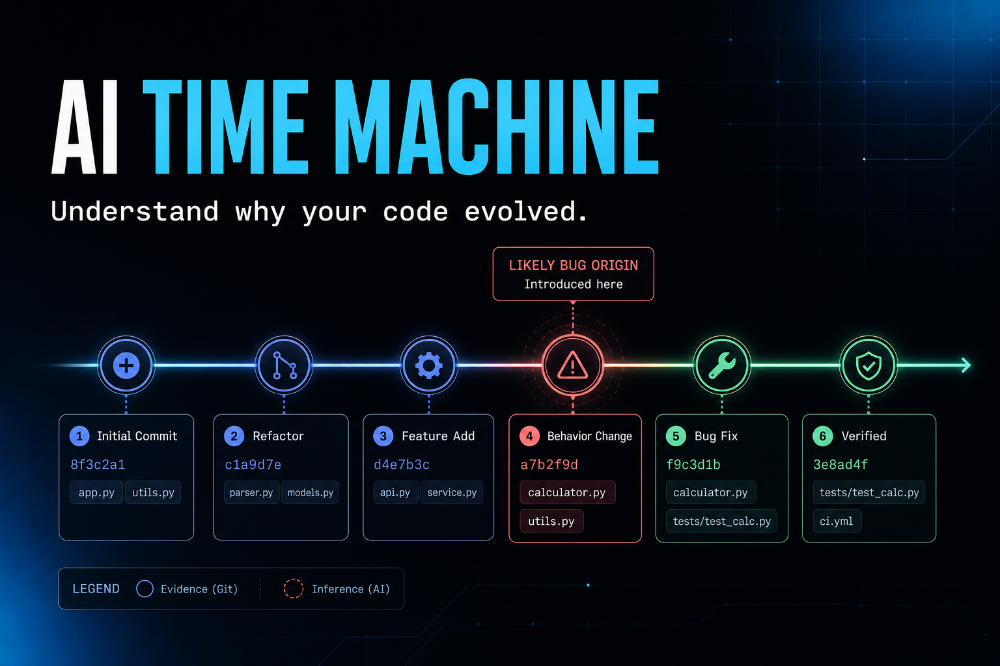

# AI Time Machine

AI Time Machine turns real Git history into an interactive, evidence-backed
timeline explaining why a codebase evolved.

**Public demo:** <https://ai-time-machine-demo.vedheshvit.chatgpt.site>

**Demo video:** <https://youtu.be/5LGXtmJNO0U>



This repository contains an OpenAI Build Week developer tool: a generated
OrbitCart Git repository, Git ingestion, an evidence timeline, reference-validated
GPT-5.6-in-Codex artifacts, Ask the Repo, and a visual Bug Origin Trace.

## How Codex and GPT-5.6 were used

Codex supported architecture exploration, implementation, debugging, UI
refinement, test development, trust-semantics review, and grounding evaluation.

GPT-5.6 Sol was used through ChatGPT-authenticated Codex to generate the
committed OrbitCart causal-analysis and Ask the Repo artifacts from repository
evidence. This generation happened at build time.

The hosted application does not call GPT-5.6 live. It replays an artifact only
after validating its evidence digest, event IDs, commit references, and affected
files. If validation fails, the application uses a clearly labeled deterministic
fallback instead of displaying unsupported model output.

## Real Repo Mode

Point the local tool at any Git worktree. The required flow uses only Python and
Git; it does not require GitHub OAuth, an OpenAI API key, or a paid runtime call.

```bash
python3 -m app.cli analyze /path/to/repository
python3 -m app.cli analyze /path/to/repository --branch feature/my-work
python3 -m app.cli serve /path/to/repository
python3 -m app.cli serve --open
python3 -m app.cli context /path/to/repository --base main --head HEAD
```

`analyze` prints the normalized timeline JSON and supports `--output`. `serve`
opens the existing interface at <http://127.0.0.1:8765> with the selected
repository fixed at process start. `context` reports changed files, commits in
the range, recent commits touching those files, connected incidents or fixes,
and risks that Git actually records.

For ordinary repositories, the Developer Workspace adds a visual **Review my
branch** report and four adaptive deterministic questions. Their answers cite
clickable commits and same-event files and are labeled `Local evidence engine ·
deterministic`; they are not GPT output. `serve` defaults to the current
worktree, and `--open` launches the local page automatically.

Ordinary commit subjects and diffs remain confirmed Git evidence. Conventional
commit classifications are marked inferred, while absent rationale and risk are
shown exactly as `not recorded`. OrbitCart-only Ask the Repo and Bug Origin
artifacts are not exposed for generic repositories.

The workflow is dogfooded on this repository: its M0-M4 commits render in
chronological order, shared files connect milestones, and the foundation-to-HEAD
context report is grounded in real changed files. See
[the M4.5 implementation brief](docs/M4.5_REAL_REPO_MODE.md).

## Quick start

Requirements: Python 3.11+ and Git. No third-party packages are required.

```bash
git clone https://github.com/ved-devAI/AI_Time_Machine.git
cd AI_Time_Machine
python3 scripts/create_orbitcart.py
python3 -m app.server
```

Open <http://127.0.0.1:8765>.

The local app reads the generated OrbitCart Git repository at request time. The
public demo is an API-free snapshot produced from that same repository during
deployment. Its timeline and Codex references are checked before publication,
and the UI labels hosted evidence as a verified Git snapshot rather than a live
model call.

## Quick test without rebuilding

Analyze the current Git worktree directly, or open it in Real Repo Mode:

```bash
python3 -m app.cli analyze .
python3 -m app.cli serve --open
```

These commands read the existing repository history and do not regenerate the
OrbitCart demo repository.

## Verify everything

Run the complete zero-dependency verification suite:

```bash
python3 scripts/verify.py
```

This regenerates OrbitCart, runs all application and repository tests, validates
both Codex artifacts, produces a deterministic grounding scorecard, and checks
the browser JavaScript and repository whitespace.

Individual commands:

```bash
python3 -m unittest discover -s tests -v
PYTHONPATH=.data/orbitcart python3 -m unittest discover -s .data/orbitcart/tests -v
python3 scripts/codex_artifact.py validate
python3 scripts/ask_repo_artifact.py validate
python3 scripts/evaluate_grounding.py
```

## How it works

1. `scripts/create_orbitcart.py` creates a genuine 12-commit demo repository.
2. `app/git_ingest.py` reads generic commit metadata, changed files, overlap
   history, and branch/range context using Git.
3. `scripts/codex_artifact.py` exports evidence and validates a strict,
   reproducible GPT-5.6-in-Codex artifact.
4. `app/analysis.py` verifies artifact provenance, evidence digest, event IDs,
   commit hashes, and file references before returning an investigation.
5. `app/ask_repo.py` serves three reference-validated, evidence-linked repository answers.
6. `app/repo_questions.py` produces and validates four deterministic answers
   for ordinary repositories.
7. `app/cli.py` selects a local repository for analysis, context, or serving.
8. `app/server.py` exposes the selected timeline and branch review while restricting reference-validated
   OrbitCart artifacts to OrbitCart.
9. `frontend/` renders the Developer Workspace, Ask the Repo, the timeline, and
   the Bug Origin Trace.

The default flow makes no paid runtime call. It replays the committed artifact
generated by GPT-5.6 Sol through ChatGPT-authenticated Codex. If the artifact is
missing or fails validation, the investigation remains runnable using an
explicitly labeled local evidence fallback.

## Reproduce the Codex artifact

```bash
python3 scripts/codex_artifact.py prepare
codex exec -m gpt-5.6-sol -s read-only \
  --output-schema artifacts/orbitcart/analysis.schema.json \
  -o .data/codex-run/analysis.json \
  "Read artifacts/orbitcart/analysis.prompt.md and perform that task."
python3 scripts/codex_artifact.py finalize .data/codex-run/analysis.json \
  --model gpt-5.6-sol
python3 scripts/codex_artifact.py validate
```

Ask the Repo uses the same workflow with `artifacts/orbitcart/ask-repo.prompt.md`,
`scripts/ask_repo_artifact.py`, and its own strict output schema. Both committed
artifacts are tied to the same OrbitCart evidence digest.

`codex exec` reuses ChatGPT-managed Codex authentication. The app does not need
an API key to replay the reference-validated result.

See [the analysis design](docs/ai-analysis.md) for grounding and fallback details
and [the evaluation guide](docs/EVALUATION.md) for the scorecard.

## Public deployment

```bash
python3 scripts/create_orbitcart.py
python3 scripts/build_public_demo.py
```

The build writes a static client and a minimal host worker to `dist/`. Pushes to
`main` run the full verification suite; production releases package the same
reference-validated build for the public host. No API key or paid runtime call is required.

## Release screenshots

- [Desktop product overview](docs/screenshots/ai-time-machine-desktop.png)
- [Bug Origin Trace](docs/screenshots/ai-time-machine-bug-origin-trace.png)
- [390 × 844 mobile trace](docs/screenshots/ai-time-machine-mobile-390x844.png)
